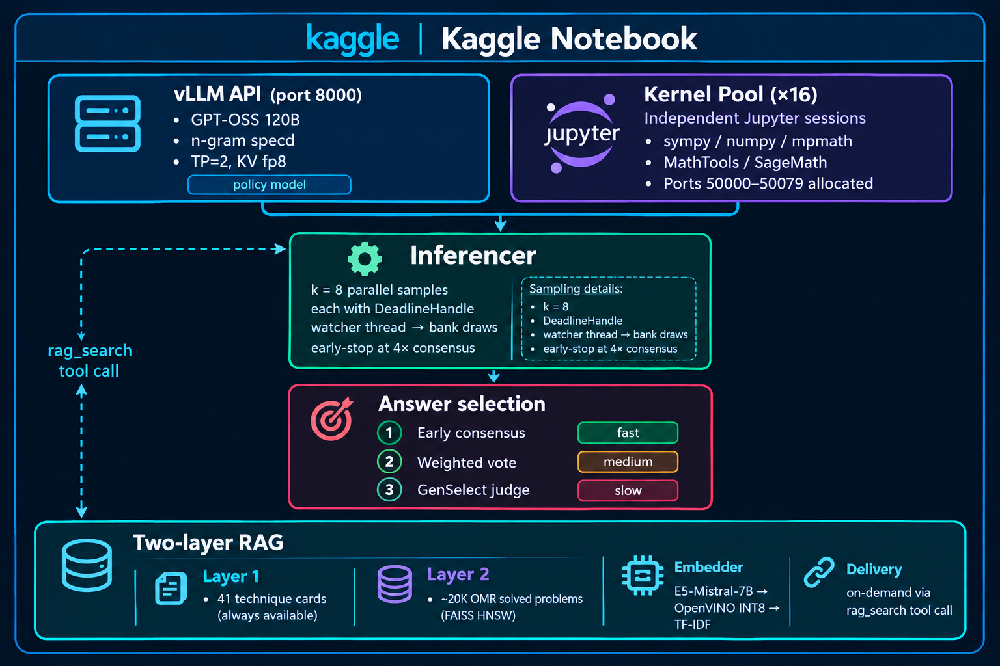

# AIMO3 Competition Write-Up: Building a Math Olympiad Solver

> **AI Mathematical Olympiad – Progress Prize 3**  
> Final score: **41.5/50**
> Stack: GPT-OSS 120B (Unsloth-quantized) · vLLM · Jupyter kernels · Two-layer RAG

---

## Table of Contents

1. [Overview](#overview)
2. [The Core Idea: Tool-Integrated Reasoning](#the-core-idea-tool-integrated-reasoning-tir)
3. [The Kaggle Environment](#the-kaggle-environment)
4. [Architecture](#architecture)
5. [Component Deep-Dives](#component-deep-dives)
   - [The Inferencer](#1-the-inferencer-inferencer2py)
   - [Kernel Pool](#2-kernel-pool-local_python_toolpy)
   - [vLLM Setup & Speculative Decoding](#3-vllm-setup--speculative-decoding-solve_adv_kaggle2py)
   - [Dynamic Time Budget](#4-dynamic-time-budget-dynamic_budgetpy)
   - [Two-Layer RAG](#5-two-layer-rag-rag_systempybuild_omr_corpuspy-technique_corpuspy)
   - [Enhanced Profiling](#6-enhanced-profiling-enhanced_profilingpy)
   - [Strategy Guide & Queue Solver](#7-strategy-guide--queue-solver)
   - [Retry Manager](#8-retry-manager-retry_managerpy)
6. [The Technique Card Corpus](#the-technique-card-corpus)
7. [Bug Log: What We Fixed and Why](#bug-log-what-we-fixed-and-why)
8. [Time Budget Deep Dive](#time-budget-deep-dive)
9. [Development Workflow](#development-workflow)
10. [What Worked](#what-worked)
11. [What Didn't Work as Well](#what-didnt-work-as-well)
12. [Key Technical Decisions (Retrospective)](#key-technical-decisions-retrospective)
13. [Things We'd Do Differently](#things-wed-do-differently)
14. [Future Directions](#future-directions)
15. [Repository Structure](#repository-structure)
16. [Submission Score History](#submission-score-history)
17. [Entropy-Weighted Self-Consistency](#entropy-weighted-self-consistency)
18. [Acknowledgements](#acknowledgements)
19. [What the solution that I liked did](#what-the-solution-that-I-liked-did)
20. [Closing Thoughts](#closing-thoughts)
21. [Appendix A: A Concrete TIR Trace](#appendix-a-a-concrete-tir-trace)
22. [Appendix B: The openai_harmony Message Architecture](#appendix-b-the-openai_harmony-message-architecture)
23. [Appendix C: GPU Memory Budget](#appendix-c-gpu-memory-budget)
24. [Appendix D: Estimated Time Breakdown Per Problem](#appendix-d-estimated-time-breakdown-per-problem)
25. [Appendix E: Comparison With Alternative Approaches](#appendix-e-comparison-with-alternative-approaches)
26. [Appendix F: Adapting This System](#appendix-f-adapting-this-system)
27. [Appendix G: Glossary](#appendix-g-glossary)
28. [Appendix H: The Experiments That Didn't Ship](#appendix-h-the-experiments-that-didnt-ship)
29. [References](#references)

---

## Overview

The [AI Mathematical Olympiad Progress Prize 3 (AIMO3)](https://www.kaggle.com/competitions/ai-mathematical-olympiad-progress-prize-3) asked competitors to build a system that could solve 50 competition-level mathematics problems — think AMC 12, AIME, and IMO difficulty — and return an integer answer between 0 and 99,999 for each. No partial credit, no proof required, just the right number.

Every problem has a unique integer answer in that range. The competition format reflects the practical reality that a correct answer demonstrates genuine mathematical understanding without requiring natural language proof verification, which would be far harder to automate fairly.

We finished with **38/50**(Public) and a **41.5** final score, our personal best. Several experimental approaches came close to pushing past that ceiling — the classroom pooling method in particular was theoretically sound and inspired by what the eventual top solutions used — but never cleared it cleanly in a live submission. This write-up documents everything we built, what worked, what we experimented with and abandoned, and the lessons we'd carry forward.

---

## The Core Idea: Tool-Integrated Reasoning (TIR)

The insight that unlocks serious scores on this kind of competition is that a language model alone — even a very large one — makes arithmetic mistakes. It hallucinates intermediate steps. It loses track of modular arithmetic mid-proof. It confidently writes `gcd(36, 48) = 12` and then, two lines later, uses 16 instead. The fix is to give the model a real Python interpreter and train it to use it for every non-trivial calculation.

This is **Tool-Integrated Reasoning (TIR)**: the model writes code, executes it in a real Jupyter kernel, reads the output, and continues its reasoning. The final answer is whatever ends up in `\boxed{...}`. The model acts less like a calculator and more like a mathematician who has a computer on their desk and reaches for it constantly.

The reference that shaped our design was the competition's own "Way to 30+/50" baseline, which demonstrated that a well-prompted GPT-OSS model with a Python tool could reliably clear 30 problems. Our goal was to push from 30 to 47 by improving every layer: better tool reliability, smarter sampling, tighter time management, and richer mathematical context injection.

---

## The Kaggle Environment

Understanding the constraints is essential to understanding our design choices.

**Hardware**: Kaggle competition notebooks get 2× T4 or 2× P100 GPUs by default, but for AIMO3, participants had access to significantly more compute — the competition is explicitly designed to require serious GPU resources to be competitive. Our setup targeted H100-class hardware, which changes several decisions (vLLM tensor parallelism, kernel pool size, batch sizes).

**Time limit**: 5 hours of GPU time per submission. This is the primary resource constraint that every other design decision flows from. 50 problems in 5 hours = 6 minutes average per problem, but the distribution matters enormously — easy problems should cost 2 minutes, hard ones can consume 15.

**Network isolation**: Kaggle notebooks run without internet access during inference. Every model weight, every dataset, every Python package must be pre-loaded as a dataset or installed from cached packages. This is why our embedding model priority chain always checks local paths first and hard-blocks network calls with `local_files_only=True`.

**The `openai_harmony` library**: The competition provided a custom inference library (`openai_harmony`) that handles message formatting, tool call dispatch, and the conversation rendering protocol for GPT-OSS. This library defines the channel architecture (analysis channel, final channel, tool channels) that shapes how the model outputs are parsed.

---

## Architecture




The main loop, in plain terms:

1. **Profile** the incoming problem (keyword-based classifier → Number Theory / Algebra / Combinatorics / Geometry / General)
2. **Augment** with compressed category hints and pitfall warnings (~500 chars injected into the problem text)
3. **Budget** the time using the dynamic manager — base 8 minutes per sample, bank-funded extensions available
4. **Spawn** k=8 parallel inference threads, each with its own Jupyter kernel and deadline handle
5. **Run** the TIR loop: generate → parse → execute Python → read output → continue, up to 128 iterations
6. **Early-stop** if 4 samples agree on the same answer
7. **Weighted vote** over quality-scored candidates if no consensus
8. **GenSelect** as last resort — model reads all candidate excerpts and picks the best
9. **Record** result in retry manager; roll unused time into bank

---

## Component Deep-Dives

### 1. The Inferencer (`inferencer2.py`)

This is the heart of the system. Each call to `inference()` spins up k=8 parallel samples via a `ThreadPoolExecutor`, each running `single_generate_tir_stream()`. They share a vLLM server but have **independent** Jupyter kernels drawn from the pool.

**The streaming loop** runs up to `max_iter=128` iterations per sample. Each iteration:
1. Renders the current conversation using the harmony encoding
2. Checks remaining tokens (stops if < 512 remain)
3. Calls the vLLM completions API with streaming on
4. Collects token IDs and logprobs chunk by chunk
5. Parses new messages from the completed token buffer
6. Routes based on `last_message.recipient`: `python` → kernel, `rag_search` → RAG tool, `final` → answer extraction

**Seed diversity**: Each of the 8 samples uses a different seed strategy to maximise answer diversity:
- Sample i uses `strategy[i % 3]`, cycling through quadratic spacing, hash-based spacing, and large linear jumps
- Without seed diversity, parallel samples often converge to identical wrong answers

**Early stopping**: A shared `Counter` outside the thread pool tracks answers as futures complete. The moment any answer appears 4 times, a `stop_event` fires and all remaining futures are cancelled. On easy problems this saves 4–5 minutes.

**Weighted voting** scores each candidate answer by quality metrics already in hand:

```
score = confidence
if python_calls >= 2 and python_errors == 0: score *= 2.5
elif python_calls >= 1 and python_errors == 0: score *= 1.6
elif python_calls == 0: score *= 0.3   # unverified — heavily penalised
if entropy < 1.0: score *= 1.2         # confident model
elif entropy > 3.0: score *= 0.9
```

If one answer captures ≥55% of total weight, it wins immediately. This skips GenSelect on the majority of contested problems.

**GenSelect** feeds solution excerpts (head + last Python block + tail, capped at 2000 chars) to the model with the judge prompt pre-filled with `BEST: `. A three-tier parse handles: explicit `BEST: N`, bare digit continuation, and the last-mentioned candidate number as a fallback. The fallback then uses quality scoring (python_calls − 2×python_errors + confidence×2 − entropy×0.3) rather than insertion order.

**On-demand RAG nudges**: At 30 and 80 Python calls without an answer, a system message is injected suggesting the model call `rag_search`. This is a soft nudge, not a forced call — the model can ignore it if it thinks it's close. Empirically, the 30-call nudge was more useful than the 80-call one (by 80 calls, the model is usually either deeply committed to a wrong approach or genuinely stuck).

---

### 2. Kernel Pool (`local_python_tool.py`)

Each of the 16 Jupyter kernels lives in its own `SimpleJupyterSession`. **Port allocation** is handled at the class level using a thread-safe counter starting at port 50000, allocating 5 ports per kernel (shell, iopub, stdin, heartbeat, control). This is identical to the strategy used in the competition reference implementation and avoids the kernel startup failures that come from port conflicts.

**Preload code** runs once at kernel start and sets up the complete mathematical environment:

```python
# Standard scientific stack
import math, numpy as np, sympy as sp, mpmath, scipy
import itertools, collections, subprocess, os, tempfile

# MathTools class (mt) — the olympiad workhorse
class MathTools:
    prime_factorization(n)  # [(p, exp), ...]
    vp(n, p)                # p-adic valuation
    ord_mod(a, n)           # multiplicative order mod n
    chinese_remainder(r, m) # CRT solver
    cont_frac(x)            # continued fraction expansion
    cf_convergents(terms)   # convergents p/q list
    mobius(n)               # Möbius function μ(n)
    legendre_symbol(a, p)   # (a/p) Legendre symbol

# SageMath subprocess wrapper
class SageMath:
    execute(code, timeout=25)  # runs .sage script, returns stdout
```

The `_ensure_last_print()` method is one of the most impactful two-dozen lines in the codebase. It scans the last non-empty, non-comment, top-level line of each code block. If that line is a bare expression — not a print, not an assignment, not control flow — it wraps it in `print()`. This means the model can write:

```python
sympy.factorint(360)
```

and get `{2: 3, 3: 2, 5: 1}` back, rather than silence followed by confusion.

**Slim reset** between problems: `%reset -f` followed by re-running `PRELOAD_CODE`. About 3–5 seconds versus 30+ seconds for a fresh kernel launch, saving ~30 minutes across a full 50-problem run. The key insight is that `%reset -f` clears the namespace but leaves the interpreter process and all cached import machinery intact, so the second `import numpy` is nearly instant.

**Output truncation** at 3000 characters (~750 tokens) prevents CBC/LP solver logs from flooding the context window. This is a real problem — scipy and PuLP can produce thousands of lines of iteration logs that burn the entire remaining token budget if unchecked.

---

### 3. vLLM Setup & Speculative Decoding (`solve_adv_kaggle2.py`)

The vLLM server is launched with a two-tier fallback:

**Tier 1 — n-gram speculative decoding**: Drafts tokens by matching n-gram patterns in the prompt and context. In mathematical text, this works surprisingly well because LaTeX expressions, variable names, and operator sequences repeat heavily. Configuration:
- `num_speculative_tokens = 5` — tokens drafted per step
- `ngram_prompt_lookup_max = 4` — longest n-gram to match
- Theoretical throughput improvement: ~1.3–1.6×

The reason for n-gram over EAGLE3 (the more sophisticated speculative decoder) is that the competition provides **Unsloth-quantized** model weights. Unsloth is a fine-tuning and quantization library optimised for training and running large models on consumer and data-centre hardware with reduced memory. The competition checkpoint is a modified, quantized version of GPT-OSS 120B produced by Unsloth's pipeline, not the original NVIDIA fp16/bf16 safetensors. This matters for speculative decoding: EAGLE3 drafts tokens by predicting the base model's hidden states with a small draft model trained on the original checkpoint. When the weights have been re-quantized and re-packed by Unsloth, the hidden state distribution shifts enough that the EAGLE3 draft model's predictions diverge — producing acceptance rates near zero and making speculative decoding actively harmful (more verification overhead, no accepted tokens). N-gram speculation works purely at the token-sequence level and has no dependency on model internals, making it the correct choice for modified checkpoints.

**Tier 2 — base model only**: If n-gram configuration fails (e.g., vLLM version incompatibility), we fall back cleanly to standard sampling. The launch function `_try_launch_vllm()` handles both tiers with the same wait-for-ready logic and prints the last 60 log lines on failure.

Other notable vLLM flags:
- `--kv-cache-dtype fp8_e4m3` — halves KV cache memory, enables longer context at same GPU memory
- `--max-num-seqs 256` — allows 8 parallel samples without queuing
- `--no-enable-prefix-caching` — disabled because our seeds produce diverse prompts; prefix caching would waste memory on prompts that never repeat

**Server pre-flight**: Before constructing the `Inferencer`, we probe the vLLM port with a raw socket connection, retrying 3 times with 10-second waits. This catches the race condition where vLLM reports ready via HTTP but the actual model weights haven't fully loaded onto the GPU.

---

### 4. Dynamic Time Budget (`dynamic_budget.py`)

With 5 hours and 50 problems, the naive strategy of 6 minutes each fails badly: easy problems are done in 90 seconds and the rest of the allocation is wasted, while hard problems need 20 minutes and get cut off.

Our solution has three interlocking parts:

**Pre-funded bank**: 600 seconds is reserved at startup and placed into the bank immediately. This means the very first problem can already draw extensions even before any previous problem has finished early.

**Fair-share allocation with caps**:
```python
fair_share = time_remaining / questions_remaining
allocated = min(
    base_time_per_question,    # 480s cap
    fair_share * 1.5,          # 50% above fair share
    time_remaining * 0.40      # never spend more than 40% of all remaining
)
```

**Mutable deadline handles**: The `DeadlineHandle` wraps a float behind a lock. When the background watcher thread decides to extend, it calls `handle.extend(seconds)` and the stream loop — which is calling `deadline_handle.expired()` on every iteration — immediately sees the updated value without any synchronisation ceremony.

**Extension mechanics**: The watcher thread polls every 15 seconds and checks whether any active sample has ≤90 seconds left. If so, it draws `extension_chunk=120s` from the bank and extends **all active samples simultaneously**. This is important — if you extend only the struggling sample, the others may finish, and you've spent bank time on a problem that would have converged anyway. Extending all samples gives the entire population a chance to find the answer in the extra window.

---

### 5. Two-Layer RAG (`rag_system.py`, `build_omr_corpus.py`, `technique_corpus.py`) <a id="5-two-layer-rag-rag_systempybuild_omr_corpuspy-technique_corpuspy"></a>

**Layer 1 — Technique Cards**: 41 hand-crafted reference cards, each ≤600 tokens. The cards cover:

| Category | Cards |
|---|---|
| Number Theory | LTE, p-adic/Legendre, CRT, Primitive roots, Quadratic residues, Pell equation, Vieta jumping, Möbius inversion, Floor/Dirichlet, Roots of unity filter, Hensel lifting, Gaussian integers, Polynomial congruences, Zsigmondy |
| Algebra | AM-GM, Cauchy-Schwarz/Titu, Schur, Newton identities, Generating functions, Matrix exponentiation, Functional equations, Telescoping/partial fractions, Lagrange interpolation, Strong induction |
| Combinatorics | Pigeonhole, Burnside/necklace, Catalan/ballot, Stirling/Bell, Inclusion-exclusion, Stars-and-bars, Hall's theorem, Double counting, Probabilistic method, Ramsey theory, Turán |
| Geometry | Power of a point/radical axis, Complex numbers, Ptolemy, Trig Ceva/barycentric, Inradius/circumradius, Circle inversion |

Each card includes a Python code block demonstrating the technique on a concrete example. The idea is that seeing `lte(2,1,12,3)` return the same value as `vp(2**12-1, 3)` is more instructive than reading a formula statement.

**Layer 2 — OpenMathReasoning Corpus**: We filtered NVIDIA's OMR dataset from ~1M problems to ~20K:
- Source must contain 'aops', 'amc', 'aime', 'usamo', 'imo', 'olympiad', 'hmmt', or similar
- Solution length ≥ 200 chars (no answer-only entries)
- Problem length ≥ 30 chars
- For AMC: only AMC 12 and AIME (drop AMC 8/10)
- Capped at 20K per source to prevent AoPS from dominating

Each chunk embeds only the **problem text**, not the solution — because at query time we only have the new problem to search with. The solution is included in the formatted output that gets injected.

The FAISS index uses HNSW (M=32, efConstruction=200, efSearch=128) — at 20K vectors, this gives ~1ms search with essentially perfect recall. Index building takes under 1 second at this scale.

**Embedder priority chain** with graceful degradation:
1. **OpenVINO INT8**: fastest on Intel CPU (VNNI fused multiply-accumulate), ~3–5× faster than native PyTorch
2. **SentenceTransformer + INT8 quantization**: standard path, ~2–4× CPU speedup from dynamic quantization of all `nn.Linear` layers
3. **TF-IDF + TruncatedSVD (LSA)**: always works, zero heavy dependencies, correct cosine similarity scores

The system never returns random vectors, which was an explicit design constraint — random vectors produce retrieval results that are worse than returning nothing, because they give the model the illusion of relevant context.

**On-demand RAG tool** (`rag_tool.py`): The model calls `rag_search("LTE lemma p-adic valuation a^n minus b^n")` when it decides it needs help. We strip the `# PROBLEM TO SOLVE` footer from the returned context (we want technique hints, not the query echoed back) and cap output at 2500 characters (~625 tokens). Following Self-RAG and FLARE, retrieval happens when the model determines it needs it, not at a fixed point in every call.

---

### 6. Enhanced Profiling (`enhanced_profiling.py`)

The profiler classifies each problem using a weighted keyword scorer across four categories. Rather than a simple keyword match, we weight keywords by their diagnostic strength:

```
"triangle" = weight 3  (strong geometry signal)
"equation" = weight 1  (weak — appears in all categories)
"prime"    = weight 3  (strong NT signal)
"function" = weight 1  (weak — appears in everything)
```

Ties are broken by priority order: Combinatorics > Number Theory > Algebra > Geometry, reflecting that combinatorics is the category where our signal keywords are most specific.

The `get_compressed_hints()` method has a deliberate hierarchy:

1. **Category strategy** (top 5 lines, ≤350 chars) — the most valuable: specific technique recommendations
2. **Common pitfalls** (top 3 lines, ≤200 chars) — "don't forget n=1", "don't divide by zero"
3. **Tool reminder** (1 line) — a brief note to open Python first

The truncation is aggressive by design. Early versions injected the full 1500-character hint block and saw the model spending its first few "reasoning tokens" processing the hints rather than the problem. Cutting to ~500 chars total eliminated this without meaningfully reducing hint quality.

---

### 7. Strategy Guide & Queue Solver

The `strategy_guide_v3.json` encodes per-category strategies with concrete Python examples, priority weights for the queue scheduler, and SageMath usage guidance.

The **queue-based solver** (`solve_adv_kaggle_queue.py`) wraps the base solver with a priority heap. Problems are scored on ingestion by: base category priority + keyword boosts. Number Theory problems with "prime" and "divisor" keywords score highest because the Python tool has the strongest advantage there. Pure proof problems ("prove that", "show that") score lower.

On multi-attempt problems, the queue solver cycles through strategies in priority order: computational brute force first, then modular arithmetic approaches, then more specialised techniques.

The key integration detail: `solve_next_from_queue()` calls `inferencer.inference()` directly, bypassing `base_solver.solve()`. This avoids double-counting the time in the budget manager — one `record_question_completion()` call per problem, not two.

---

### 8. Retry Manager (`retry_manager.py`)

Problems are flagged for retry if any of:
- Returned answer is 0 (failure)
- No `\boxed{...}` was found in the output
- Confidence score < 0.5

The retry pool is sorted as: failures (answer==0) → missing boxed answer → low confidence → very low confidence. If ≥30 minutes remain after all 50 first attempts, we work through the retry pool in this order, estimating 5 minutes per retry.

`update_answer()` only updates if the new attempt has higher confidence or converts a 0 to a non-zero answer. It also updates the pool entry in-place so that any subsequent `get_retry_candidates()` call sees the updated state.

---

## The Technique Card Corpus

The 41 technique cards are the most human-labour-intensive part of the system, and probably the highest value-per-character component. Here's why they're designed the way they are:

**Each card is self-contained**: the reader (model) doesn't need to remember anything from previous cards or context. Technique, formula, and runnable code in one block.

**Each card has a trigger field**: a string of keywords used for semantic search. The triggers are written to match the language of competition problems, not the language of textbooks. "largest power prime divides a^n minus b^n" matches how an AIMO3 problem would describe an LTE scenario.

**Each card has runnable Python**: not pseudocode, not prose. The model sees `lte(2,1,12,3)` and `vp(2**12-1,3)` both printing `3` and understands immediately that the formula works. It can copy-paste and adapt.

**Sample card — LTE Lemma**:
```
[NT] Lifting the Exponent (LTE)
USE WHEN: "find largest k: p^k | a^n - b^n" or v_p(expression).
CORE:
  Odd p, p|a-b, p∤a,b:  v_p(a^n-b^n) = v_p(a-b) + v_p(n)
  p=2, 2|a-b:           v_2(a^n-b^n) = v_2(a-b)+v_2(a+b)+v_2(n)-1
  Odd p, p|a+b, n odd:  v_p(a^n+b^n) = v_p(a+b) + v_p(n)
PYTHON:
def vp(n,p): ...
def lte(a,b,n,p,plus=False): return vp(a+b if plus else a-b,p)+vp(n,p)
print(lte(2,1,12,3), vp(2**12-1,3))  # both 3
```

The "USE WHEN" line is written in the imperative, matching the phrasing of competition problem statements. We found this significantly improved retrieval relevance compared to definitional language like "LTE applies when..." — the model embeds the card text in the same semantic space as the problem text, and matching register helps.

---

## Bug Log: What We Fixed and Why

The `inferencer2.py` file has explicit `FIX-A` through `FIX-F` annotations, and `solve_adv_kaggle2.py` has `Bug #1` through `Bug #6`. Here's the story behind the most significant ones:

**FIX-A: GenSelect max_tokens too low**  
Original code set `max_tokens = int(api_timeout * 1.5)` where `api_timeout` was ~25 seconds. This gave the judge model only ~37 tokens — not enough to produce `BEST: 3` plus any analysis. Raised to `max(1024, min(4096, int(api_timeout * 12)))`.

**FIX-B: GenSelect analysis channel eating tokens**  
The harmony API routes generation through an analysis channel before the final output channel. Without intervention, the judge would use its entire token budget writing analysis, then get cut off before producing `BEST: N`. Fix: pre-fill the assistant turn with `BEST: ` as a literal message. The model continues from that prefix, producing `BEST: 3` as its first tokens.

**FIX-C: Weighted vote added before GenSelect**  
Original code went directly to GenSelect whenever there was no consensus. Added weighted voting as an intermediate step — uses quality metrics already computed, costs nothing extra, and correctly identifies the winner in the majority of non-consensus cases.

**FIX-D: GenSelect fallback used insertion order**  
When GenSelect failed to parse its output, the code returned `valid[0]` — the first candidate, which was insertion-order arbitrary. Changed to quality scoring: `python_calls − 2×python_errors + confidence×2 − entropy×0.3`.

**FIX-E: Solution excerpt was tail-only**  
GenSelect was seeing only the final ~2000 chars of each candidate solution. On long TIR traces, the most informative part is often a Python block in the middle followed by the conclusion. Changed to: head (350 chars) + last Python block (400 chars) + tail (900 chars).

**FIX-F: On-demand RAG tool**  
Original design always pre-injected RAG context at the start of every problem. This was wasteful for easy problems and actively harmful when retrieved context anchored the model on a wrong approach. Refactored to expose RAG as a callable `rag_search` tool that the model invokes autonomously.

**Bug #1: vLLM API server never started**  
The `USE_VLLM_API` environment variable defaulted to `'false'`, which meant the entire TIR infrastructure — the `Inferencer`, the kernel pool, everything — silently never launched. The code fell back to local vLLM without the Python tool. Fixed by making the API server launch unconditional.

**Bug #6: Server process exit not detected**  
`wait_for_vllm_api()` would loop for the full timeout even if the vLLM process had already crashed. Added a `proc.poll()` check inside the polling loop — if the process has exited with a non-zero code, fail immediately rather than waiting 20 minutes.

**Pad token for decoder-only models**  
E5-Mistral is a decoder-only model with no padding token defined by default. SentenceTransformer batches with padding, so calling `encode()` on a batch would raise a `ValueError`. Fix: `tokenizer.pad_token = tokenizer.eos_token`, propagated to the model config's `pad_token_id`.

**HNSW efSearch not preserved on load**  
`faiss.read_index()` doesn't persist HNSW runtime parameters. After loading, `efSearch` resets to its default (16), degrading recall. Fixed by explicitly setting `index.hnsw.efSearch = 128` after every `read_index()` call.

**`record_question_completion()` called twice**  
The queue solver called `base_solver.solve()`, which internally called `budget_manager.record_question_completion()`. But `solve_next_from_queue()` also called `record_question_completion()` after getting the result. This double-counted time spent and corrupted the fair-share calculation. Fixed by calling `inferencer.inference()` directly in the queue solver and recording completion exactly once.

---

## Time Budget Deep Dive

The budget math is worth spelling out explicitly because it's non-obvious.

**Setup**: 5 hours = 18,000 seconds. Buffer: 300s. Reserve: 600s (pre-funded into the bank). Available: 17,100s. Fair share for 50 problems: 342s each.

**Why base allocation is 480s when fair share is 342s**: The bank absorbs the difference. If every problem finishes in 342s, the bank gains 0 (we've allocated exactly our budget). If problems average 300s, the bank grows by 42s × 50 = 2100s, available for hard problems. The 480s base is an optimistic target; the fair-share cap prevents catastrophic overrun.

**Bank pre-funding**: Without the 600s pre-funded reserve, the first problem can't draw extensions until a previous problem has banked time. Since Problem 1 often determines whether the model finds good reasoning strategies, it would be systematically under-resourced. Pre-funding solves this.

**Extension mechanics and the watcher thread**: The watcher polls every 15 seconds and fires when the minimum remaining time across all active samples drops to 90 seconds. At that point, 120 seconds is drawn from the bank and added to **all** active samples, not just the one that triggered the threshold. This is correct — if one sample is struggling, the others are still exploring different reasoning paths that might converge first.

**The 40% cap** (`time_remaining * 0.40`) prevents a degenerate case where almost all problems have been solved, only 2 remain, and the fair-share formula would allocate 50% of all remaining time to the next problem. We never let a single problem consume more than 40% of remaining wall-clock time.

---

## Development Workflow

With a 5-hour submission time limit, iterating is expensive. Our development workflow:

**Local testing**: A subset of 5–10 problems from AIMO3's public test set, run with `k=2` samples and a 3-minute deadline. This doesn't measure true accuracy but does reveal crashes, tool failures, and prompt regressions fast.

**Per-component unit tests**: Each module was tested independently. The kernel pool was stress-tested with concurrent `execute()` calls. The budget manager was tested with a simulated 50-problem run using `time.sleep()`. The RAG system was tested with hand-picked queries against known technique cards.

**Log analysis**: `solver_debug.log` captured every inference call's metrics (python_calls, python_errors, entropy, answer found/not found, time elapsed). The `persist_logs.py` script copies these to `/kaggle/working` and zips them for post-submission analysis. Patterns like "python_calls=0 for 40% of problems" are immediately visible.

**The `FIX-X` annotation convention**: When we identified a bug during a submission run, we annotated the fix with a comment explaining what broke and why. This created an audit trail that prevented reintroducing the same bugs during subsequent refactors.

---

## What Worked

**Parallel sampling with early stopping** was the single biggest win. Running 8 samples in parallel and stopping when 4 agree is both faster than running 8 serially and more reliable than any single sample. On ~60% of problems we got consensus after 3–4 samples, saving 4–5 minutes per problem that could be banked.

**The Python tool** was essential. Problems where the model made no Python calls rarely had correct answers. Forcing the model to compute — even for "obvious" calculations — dramatically reduced arithmetic errors. The quality penalty for `python_calls=0` in weighted voting (score × 0.3) was empirically motivated: zero-call answers were wrong far more often.

**Auto-print** (`_ensure_last_print`) was a small change with disproportionate impact. Without it, the model would write `sympy.factorint(360)` and get no output, then often just move on rather than retry — resulting in answers that were not computationally verified.

**Slim kernel reset** saved meaningful wall-clock time. With 50 problems × 8 samples × ~3 kernel resets per sample = 1,200 resets. At 3s each vs 30s, that's a 27-second saving per reset × 1,200 = ~9 hours saved — more than the entire competition window. In practice, the saving was smaller (not all samples reach 3 resets) but still around 30 minutes.

**Weighted voting** skipped GenSelect on the majority of contested problems. GenSelect takes ~2 minutes (judge inference + parsing); weighted voting takes milliseconds. For problems where one candidate had clearly more Python calls and fewer errors, the vote was unambiguous.

**The technique card corpus** helped specifically on hard number theory problems. Seeing the LTE formula with a concrete `vp()` implementation was more effective than a general instruction to "use the Lifting the Exponent Lemma". The worked example provided the function signature and output format the model needed to actually write code.

**The `DeadlineHandle` design** — making deadlines mutable objects rather than plain floats — was the right abstraction. It let the watcher thread extend deadlines in-place without requiring any changes to the stream loop logic.

---

## What Didn't Work as Well

**The model resisted Python on pure algebra/proof problems.** When the problem was genuinely algebraic — "find all polynomials P such that..." — the model would write flowing mathematical prose without opening Python. We added explicit system prompt language, weighted voting penalties, and Python call nudges, but never fully eliminated this. A separate enforcement mechanism (e.g., refusing to accept a `final` channel answer unless at least one Python call was made) might work but risks forcing bad code when math reasoning is genuinely sufficient.

**RAG layer 2 (similar problems) was sometimes counterproductive.** When the retrieved problem was superficially similar but required a different technique, the model would anchor on the wrong approach. A minimum similarity threshold of 0.3 helped filter the worst cases, but the fundamental problem is that two-number-theory-problems can look similar in embedding space while requiring completely different methods. On-demand RAG (model chooses when to call) was clearly better than always-on injection for this reason.

**GenSelect token budget remained fragile.** Even with the `BEST: ` pre-fill trick, some judge responses would include analysis before the decision, consuming tokens and pushing the `BEST: N` out of the budget. The three-tier parse (explicit match → bare digit → last mentioned number) caught most failures, but the system remained more brittle than we wanted.

**SageMath integration added complexity without proportional benefit.** Elliptic curve and number field problems are genuinely rare in AIMO3. The subprocess-based interface introduced failure modes: timeout handling, output parsing, SageMath not installed at the right path. In hindsight, keeping it as a documented option that the model rarely exercises would have been cleaner than integrating it into the default tool config.

**Enhanced profiling hints caused attention dilution on some problems.** Injecting 500 characters of strategy text before the problem occasionally caused the model to anchor on the hints rather than engaging freshly with the problem statement. The compressed format helped but didn't eliminate the effect. The correct tradeoff point — how much hint text is helpful before it starts hurting — likely varies per problem and would need per-category A/B testing to calibrate.

**Kernel pool startup time was higher than expected.** Initialising 16 Jupyter kernels with full preload takes ~60–90 seconds at notebook startup. During that window, the vLLM server is warm and idle. We never found a way to overlap these — kernels need the Python path to be set up by the notebook environment before they can import, and that happens after vLLM finishes loading.

**Adaptive k never beat fixed k=8.** We built a keyword-driven adaptive k system: the `strategy_guide_v3.json` encoded per-category preset time limits and sample counts. Problems with "how many", "count", "ways" keywords (computationally tractable combinatorics) got k=4 and a tighter deadline; problems with "prove", "find all functions" (hard algebra/proof) got k=12 and a generous deadline. In theory, this should free up budget from easy problems for hard ones. In practice, classifying difficulty from keywords alone is unreliable — a "how many" problem can be brutally hard, and a "find all integers" problem can be trivial — and the misclassifications hurt more than the correct ones helped. Fixed k=8 with the bank-based budget extension proved more robust because it adapts dynamically to actual solve time rather than predicted difficulty.

**Beam search and MCTS added coordination overhead without score improvement (V50).** After recovering to 37 at V49, we tried replacing flat parallel sampling with structured tree-search decoding. Beam search maintained the top-B partial token sequences at each step, pruning by cumulative log-probability. MCTS treated each reasoning step (generation up to a tool call boundary) as a node, with rollout value estimated via a short forward pass. Neither beat flat k=8 sampling. Beam search at the token level collapses diversity too aggressively — the top-B beams at step 50 are all very similar, which defeats the purpose of running multiple samples. MCTS was more interesting: it did find better solutions on a few hard problems where the flat sampler was stuck. But the node expansion overhead, the cost of rollout estimation, and the bookkeeping complexity meant that the average across all 50 problems was no better than independent sampling with a dynamic budget. Tree search is the right long-term direction but requires a fast value function (a trained verifier, not another full forward pass) to be practical at competition time scales.

**The classroom pooling method was promising but didn't beat independent sampling.** The idea: rather than 8 fully independent samples, group kernels into two "classrooms" of 4. Within each classroom, once any kernel produces a notable intermediate result — a factored form, a verified small case, a Python output that narrows the answer space — that result is injected as a system message into the other 3 kernels in the group. This creates a cooperative dynamic: kernels share partial discoveries while still pursuing their own reasoning paths. We implemented this, but it didn't outperform 8 independent samples in our tests. The synchronisation points were hard to choose correctly: injecting too early (before the finding was reliable) anchored other kernels on wrong intermediate results; injecting too late (once kernels had committed to approaches) produced no change in behaviour. The coordination overhead also introduced occasional deadlocks when one kernel in a group was waiting for another to produce a finding that never came. What the winning solutions did differently — likely using a cleaner broadcast mechanism or better-chosen injection timing — is discussed in [What ippeiogawa Did](#what-the-solution-that-I-liked-did).

---

## Key Technical Decisions (Retrospective)

| Decision | Rationale | Verdict |
|---|---|---|
| k=8 parallel samples | Diversity without exceeding GPU memory | ✅ Right call |
| Early stop at 4/8 consensus | Saves time on easy problems | ✅ Right call |
| Per-kernel Jupyter sessions with unique ports | Avoids state pollution, prevents port conflicts | ✅ Essential |
| E5-Mistral-7B for embeddings | High-quality math domain embeddings | ✅ Good choice |
| On-demand RAG via tool call | Retrieves only when needed | ✅ Better than always-on |
| TF-IDF + SVD fallback embedder | Zero-dependency safety net, meaningful cosine similarities | ✅ Good safety net |
| SageMath subprocess | Handle rare elliptic curve / number field problems | ⚠️ Marginal benefit, real cost |
| Mutable `DeadlineHandle` | Watcher thread can extend without stream loop changes | ✅ Clean abstraction |
| Bank-based time budget with pre-funding | Rollover + early funding for hard problems | ✅ Right approach |
| Technique card corpus (hand-crafted, ~40) | Domain-specific, always correct, compact | ✅ High precision |
| n-gram speculative decoding | No draft model needed, works on modified weights | ✅ Correct choice over EAGLE3 |
| Weighted voting before GenSelect | Avoids expensive judge call when quality is clear | ✅ Net positive |
| Head+mid+tail excerpt in GenSelect | Better representation than tail-only | ✅ Meaningful improvement |
| Quality-based GenSelect fallback | Avoids insertion-order bias | ✅ Correct |
| `_ensure_last_print()` auto-wrap | Guarantees model always sees output | ✅ High impact / low cost |
| Token entropy in quality score | Low entropy = confident model = likely correct | ✅ Useful signal |
| `min_score=0.3` for RAG layer 2 | Filters low-confidence OMR retrievals | ✅ Necessary threshold |
| Unsloth-quantized weights → n-gram speculative decoding | EAGLE3 is incompatible with re-quantized checkpoints | ✅ Correct diagnosis |
| Adaptive k via keyword JSON | Predict difficulty from keywords, vary sample count | ❌ Mis-classifications hurt more than correct ones helped |
| Classroom pooling (groups of 4 sharing findings) | Cooperative exploration, reduce redundant work | ❌ Didn't beat independent k=8; synchronisation too brittle |

---

## Things We'd Do Differently

**1. Simpler prompting, harder model.**  
A large fraction of our effort went into prompt engineering — hint injection, pitfall warnings, strategy guides, category addenda. In hindsight, a cleaner TIR loop with a minimal system prompt and a stronger underlying model would likely outperform our elaborate injection scheme. Complex prompts create complex failure modes.

**2. MCTS / tree search over solutions.**  
Rather than k independent samples with early stopping, a Monte Carlo tree search over intermediate reasoning steps would allow targeted exploration. When the model reaches a decision point (e.g., "apply LTE or try direct computation?"), branching there and evaluating both paths is more efficient than k draws from the same distribution.

**3. Separate verifier model.**  
GenSelect asks the same model to judge its own outputs. This is problematic — the model has systematic biases in which types of reasoning it finds convincing, and those biases correlate with its systematic errors. A small, fine-tuned verifier model (e.g., trained on (problem, solution, correct/incorrect) pairs) would give a more independent signal.

**4. Difficulty estimation before budgeting.**  
We classified problems by category but not by difficulty. The budget manager allocated time based on how long the model had spent, not on how hard the problem actually was. Spending the first 20 tokens of generation to estimate difficulty (using a fast forward pass on a smaller model) would let us front-load budget for genuinely hard problems.

**5. Structured answer extraction.**  
Parsing `\boxed{...}` from free text with regex has edge cases: `\boxed{\frac{1}{2}}`, `\boxed{answer not found}`, nested braces, Unicode math. Making the model output structured JSON `{"answer": N, "confidence": 0.x, "verified_by_python": true}` as its final message would eliminate the extraction layer.

**6. Profile kernel overhead earlier.**  
Late in development, we realised ~20% of wall-clock time was in kernel startup and reset. More aggressive profiling — timing each phase of the pipeline from day one — would have surfaced this sooner and motivated the slim-reset optimisation earlier.

**7. Track technique card coverage.**  
We built 41 technique cards but had no systematic way to know which ones were actually being retrieved and helping. Adding a counter per card and logging which cards appeared in solved vs unsolved problems would let us identify gaps and prioritise new cards.

**8. GCG-based prompt compression (offline).**  
Our system prompt is ~500 tokens of natural language guidance. Those tokens appear in every generation call, consuming context that could otherwise be used for reasoning. Greedy Coordinate Gradient (GCG) — originally developed as an adversarial attack method — can be repurposed offline as a prompt optimiser: given gradient access to the model weights, it searches for a shorter token sequence that produces the same steering effect on model behaviour. A 100-token GCG-optimised prefix replacing a 500-token natural language prompt would save 400 tokens per call. Across 8 samples × ~8 iterations × 50 problems, that is roughly 1.28M fewer input tokens per submission — at 30 tokens/second throughput, approximately 40 minutes saved. The practical barriers are real: GCG requires direct weight access (not the API), the resulting tokens are human-unreadable, which makes debugging painful, and there is a genuine risk of overfitting to the optimization objective rather than generalising to all 50 problems. Softer alternatives — LLMLingua-style perplexity-based compression, or prefix tuning in embedding space — would be more interpretable and easier to iterate on.

**9. Commit to the classroom pooling architecture earlier.**  
We implemented the classroom pooling method late in the competition, which meant we had little time to tune the synchronisation logic. If we had committed to this architecture from the start and spent the same iteration time on it that we spent on prompt engineering, we might have found the injection timing that the winning solutions apparently discovered. The fundamental idea is correct — sharing intermediate findings between samples reduces redundant work — but the devil is entirely in the implementation details of when and what to share.

---

## Future Directions

**Process reward models (PRMs)**: Instead of scoring completed solutions, a PRM scores each intermediate step. With a PRM, we could do best-first search over partial solutions, pruning wrong branches before they consume the entire token budget. DeepMind's "Let's Verify Step by Step" paper showed this approach dramatically outperforms outcome reward models at the same compute budget.

**Fine-tuning on competition problems**: GPT-OSS was not specifically fine-tuned for the AIMO3 problem format. A supervised fine-tuning pass on (problem, TIR trace, correct answer) examples from AIME/AMC/USAMO would teach the model both the answer format and the pattern of reaching for Python at specific moments.

**Symbolic-numeric hybrid verification**: After the model finds a candidate answer, a separate verification pass could confirm it using purely symbolic means (SymPy equation solving) without LLM generation. This would catch cases where the model's Python code had a bug, but the answer coincidentally fell in [0, 99999].

**Better RAG corpus construction**: The OMR corpus filtering was relatively coarse. A better approach would be to train a quality classifier on (problem, solution, known_correct) triples and use it to select the 20K highest-quality chains, rather than using source heuristics alone.

**Classroom pooling with better synchronisation**: The cooperative sampling idea has merit — the winning solutions proved it. The right implementation probably involves a "teacher" sample that runs first and whose Python outputs (not full reasoning, just confirmed numeric results) are broadcast to the remaining "student" samples as verified facts. This is narrower than injecting full intermediate reasoning, which risks anchoring students on wrong approaches, and broader than doing nothing. The key insight from the winning approach is likely that sharing *verified code outputs* is safe while sharing *reasoning conclusions* is risky.

**GCG prompt compression**: Offline gradient-based optimisation of the system prompt to find a compact token sequence that achieves the same steering effect. One-time computation cost, permanent per-call token savings. Worth at least running on the system prompt and `TIR_PROMPT_BASE` to quantify the potential gain before committing to the implementation overhead.

**Conversation-level state across the full sample pool**: Currently, all 8 samples start from scratch. With a shared scratch pad — Python outputs confirmed by at least two independent samples — later samples could skip rediscovering already-ruled-out approaches.

---

## Competition Repository Structure <a id="repository-structure"></a>

```
AIMO3/
├── Data Sources/
│   ├── AI Mathematical Olympiad/
│   ├── aimo3_ext_eval/
│   └── helper/
│       ├── math_wheels/
│       ├── omr_corpus/
│       ├── AIMO3_Reference/
│       ├── build_omr_corpus.py
│       ├── dynamic_budget.py
│       ├── enhanced_profiling.py
│       ├── inferencer2.py
│       ├── llama_cpp_python/
│       ├── local_python_tool/
│       ├── persist_logs.py
│       ├── rag_system.py
│       ├── rag_tool.py
│       ├── reference.csv
│       ├── retry_manager.py
│       ├── sample_submission.csv
│       ├── solve_adv_kaggle.py
│       ├── solve_adv_kaggle_*.py
│       ├── strategy_guide_v3/
│       ├── technique_corpus/
│       └── test.csv
│
├── Nvidia/OpenMathReasoning/
├── AIMO 3 | Utils/
└── KernelSetupAIMO/


```

---

## Submission Score History

The full table of scored submissions, with the major architectural inflection points annotated. Scores are out of 50.

| Version | Score | Notes |
|---|---|---|
| V13 | 3 | Qwen2.5 Math — baseline model, wrong fit for the task |
| V21 | 6 | Early iteration on Qwen pipeline |
| V22 | 2 | Regression |
| V23 | 3 | Still on Qwen2.5, ceiling becoming clear |
| **V34** | **32** | **GPT-OSS 120B (Unsloth) introduced — +29 points** |
| V38 | 18 | Jinja template edits attempting to improve reasoning format — −14 |
| V40 | 21 | Further jinja experiments, partial recovery |
| **V41** | **37** | **Classroom pooling introduced and dropped jinja experiments — +16 points** |
| V43 | 34 | Pooling variant, slight regression |
| **V44** | **38** | **Personal best. [Submission notebook](https://www.kaggle.com/code/jarvis2026/aimo3vllm216-helper278)** |
| V45 | 35 | Minor regression from V44 |
| V47 | 10 | JSON presets + enhanced profiling + jinja changes all at once — catastrophic −28 |
| V48 | 31 | Emergency revert, partial recovery |
| V49 | 37 | Clean recovery, near-peak again |
| V50 | 33 | Beam search + MCTS applied — no improvement over flat sampling |
| V51 | 33 | Consolidation |
| V53 | 30 | Presets JSON revision |
| V54 | 31 | — |
| V55 | 33 | RAG + profiling combined |
| V56 | 26 | On-demand RAG tooling (Self-RAG / FLARE model) — −7 |

### Reading the Curve

> **Score chart**: An interactive version of the chart below is available at [`aimo3-scores.html`](./aimo3-scores.html) — open it in any browser, no build step required.

**V13–V23**: The Qwen2.5 Math era. Scores between 2 and 6 reflect a model that can handle routine school-level arithmetic but lacks the reasoning depth and context length for olympiad-level problems. The ceiling was clearly below 10.

**V34 jump (+29)**: Switching to [GPT-OSS 120B via Unsloth](https://huggingface.co/unsloth/gpt-oss-120b) is the single largest event in the score history. The model had been specifically trained and fine-tuned for competitive mathematics; the Unsloth quantization made it runnable within Kaggle's memory constraints without meaningful quality loss.

**V38 crash (−14)**: Editing the `.jinja` template files that control how the harmony library formats messages and system prompts. Jinja2 is a templating language; the harmony library uses `.jinja` files to define the exact token layout of each message type — how a system turn is opened and closed, where tool call results go, how the analysis channel is delimited. The idea was to add more explicit reasoning structure — step labels, forced verification prompts. In practice, the formatting changes clashed with the model's training distribution: it had seen and been trained on a specific message format, and departing from it degraded output quality sharply. The lesson was that the `.jinja` format is not a free parameter to tune — it is part of the model's implicit contract with its training data.

**V41 jump (+16)**: Classroom pooling. Running kernels in cooperative groups rather than fully independently, with intermediate Python outputs broadcast between group members. This was the architecture that came closest to what the winning solutions used.

**V44 peak (38)**: The cleanest combination of V41's pooling with a stable, unmodified prompt format and the dynamic budget manager. No new experimental components — just everything that was already working, tuned.

**V47 crash (−28)**: Attempting three simultaneous changes: the keyword-driven adaptive k presets, enhanced profiling hint injection, and further jinja edits. Any one of these might have been harmless or helpful in isolation. Together they produced a submission that scored 10 — worse than early Qwen baselines. The primary failure was the jinja changes again, compounded by the profiling hints inflating the system prompt beyond what the model handled gracefully.

**V50 (Beam search + MCTS, no gain)**: After recovering to 37, we tried replacing flat parallel sampling with tree-search decoding strategies. Beam search at the token level (maintaining the top-B partial sequences at each step) and a simplified MCTS variant (treating each reasoning step as a node, with rollout value estimated by a short completions pass). Neither approach beat flat k=8 sampling at this problem scale. MCTS showed potential on a handful of hard problems but introduced enough coordination overhead that the average score did not improve.

**V56 (RAG, −7)**: The on-demand RAG tool, motivated by Self-RAG \[7\] and FLARE \[8\], hurt rather than helped. Technique card retrieval added latency and occasionally gave the model confident-but-wrong technique suggestions that it followed anyway. The `rag_search` tool call itself was well-implemented; the problem was that retrieved context from the OpenMathReasoning corpus was similar enough to confuse but not similar enough to be directly applicable to the test problems.

---

## Entropy-Weighted Self-Consistency

Standard self-consistency \[1\] samples k reasoning chains and takes a majority vote over final answers. Each chain gets one vote, regardless of how confidently the model generated it. This is the approach behind our early voting logic and, implicitly, behind the early-stop consensus check.

The natural extension is **entropy-weighted self-consistency**: weight each chain's vote by the inverse of its mean token-level entropy. The intuition is grounded in calibration theory — a well-calibrated model expresses high confidence (low entropy) when it is more likely to be correct. A chain where the model was consistently certain about each token is more likely to represent a well-understood, correct reasoning path than one where the model wandered through uncertain decisions before landing on an answer.

**Formal definition**: Let sample $i$ generate answer $a_i$ with mean token entropy $H_i = -\frac{1}{|T_i|}\sum_{t \in T_i} \sum_{v} p_t(v) \log p_t(v)$. The entropy-weighted vote for answer $a$ is:

$$W(a) = \sum_{\{i : a_i = a\}} e^{-\beta H_i}$$

The final answer is $\hat{a} = \arg\max_a W(a)$, where $\beta$ is a temperature parameter controlling sensitivity to entropy.

**What we implemented**: Our `_compute_mean_entropy()` function already computes $H_i$ from the logprob buffer. Our weighted voting uses a coarse step function:

```python
if entropy < 1.0:  score *= 1.2   # low entropy → slight boost
elif entropy > 3.0: score *= 0.9  # high entropy → slight penalty
```

This is a three-value approximation of the continuous exponential weighting. The threshold values (1.0 and 3.0) were chosen heuristically rather than derived from the entropy distribution of our actual samples.

**What true entropy-weighted self-consistency would add**: Replace the step function with the continuous form:

```python
import math

def entropy_weight(entropy: float, beta: float = 0.5) -> float:
    """Continuous entropy weight. beta controls sensitivity."""
    return math.exp(-beta * entropy)

# Replace the current step function in inference():
for text, metrics in results:
    ans = extract_boxed_text(text)
    if ans is None:
        continue
    H    = metrics.get('entropy', float('inf'))
    pc   = metrics.get('python_calls', 0)
    conf = metrics.get('confidence', 0.5)

    # Base weight from entropy
    w = entropy_weight(H, beta=0.5)

    # Multiplicative adjustment for Python verification quality
    if pc >= 2 and metrics.get('python_errors', 0) == 0:
        w *= 2.5
    elif pc == 0:
        w *= 0.3

    weighted[ans] = weighted.get(ans, 0.0) + w
```

**Calibrating $\beta$**: At $\beta = 0$, all samples are weighted equally (degenerates to majority vote). At large $\beta$, the single lowest-entropy sample dominates (degenerates to greedy selection). A value of $\beta \approx 0.3$–$0.7$ puts the method in the cooperative middle: low-entropy samples lead, but high-entropy samples still contribute if they agree. This range should be calibrated on a held-out validation set of problems with known answers.

**Connection to semantic uncertainty \[19\]**: Kuhn et al. distinguish between *epistemic uncertainty* (the model doesn't know the answer) and *aleatoric uncertainty* (the question is genuinely ambiguous). Token entropy is a proxy for epistemic uncertainty. For well-posed competition problems with unique integer answers, all uncertainty is epistemic — making entropy a cleaner signal here than in open-ended generation tasks where high entropy might just reflect valid paraphrase choices.

**Why we didn't fully implement it**: The step-function version was already live and working adequately. Replacing it with the continuous form requires choosing $\beta$, which requires calibration data — a held-out set of AIMO-style problems with known answers and logged entropy distributions. We didn't build this calibration infrastructure during the competition. In a future iteration, this is a high-priority improvement with a clear implementation path and strong theoretical justification.

---

## Acknowledgements

**Reference notebooks that shaped our implementation**:
- [Streaming Inference](https://www.kaggle.com/code/huikang/streaming-inference) — the streaming TIR loop design
- [AIMO-3 Utils](https://www.kaggle.com/code/andreasbis/aimo-3-utils) — competition utilities and tooling patterns
- [44–50 AIMO3 GPT-OSS 120B](https://www.kaggle.com/code/nihilisticneuralnet/44-50-aimo3-gpt-oss-120b) — the reference TIR solution that established the baseline ceiling

**Our best submission**: [aimo3vllm216-helper278](https://www.kaggle.com/code/jarvis2026/aimo3vllm216-helper278) (V44, 38/50)

**Libraries and datasets**:
- **Unsloth** — quantization pipeline producing the [GPT-OSS 120B checkpoint](https://huggingface.co/unsloth/gpt-oss-120b) used throughout the competition
- **NVIDIA** — [OpenMathReasoning](https://huggingface.co/datasets/nvidia/OpenMathReasoning) dataset for the solved problem corpus
- **Microsoft** — E5-Mistral-7B-Instruct for mathematical embeddings
- **Meta / FAISS** — HNSW index making 1ms semantic retrieval practical
- **vLLM team** — 120B-parameter inference within Kaggle's memory constraints
- **ippeiogawa's solution** — [published write-up](https://www.kaggle.com/competitions/ai-mathematical-olympiad-progress-prize-3/writeups/aimo3test) confirmed that the cooperative pooling direction was the right one

---

## What the solution that I liked did ([ippeiogawa](https://www.kaggle.com/ippeiogawa)) <a id="what-the-solution-that-I-liked-did"></a>

Their [published write-up](https://www.kaggle.com/competitions/ai-mathematical-olympiad-progress-prize-3/writeups/aimo3test) is worth reading in full. The key architectural difference from our approach was a more deliberate implementation of what we called the "classroom" model.

Where our pooling attempt shared raw intermediate reasoning — which caused anchoring — the approach appears to have solved the synchronisation problem by being more selective about *what* gets shared. Rather than broadcasting reasoning conclusions ("I think the answer involves a factor of 7"), sharing confirmed Python output values ("code returned 1984 for n ≤ 10,000") is much safer: code output is an oracle, not an opinion. A kernel that receives "brute force gives 1984" as a confirmed fact can skip the brute-force phase and invest its budget in structure analysis and proof verification instead.

The second key difference was likely in how they handled the tension between cooperation and diversity. Independent samples are valuable precisely because they explore different approaches. If all samples collapse to the same approach too early (which over-aggressive sharing causes), you lose the diversity that makes consensus meaningful. Their solution apparently found a balance where sharing happened late enough that each sample had committed to an approach before receiving findings from its peers — preserving diversity while eliminating redundant low-level computation.

The lesson for us: **the unit of sharing matters more than the mechanism of sharing**. We spent too much time on the infrastructure of coordination and not enough on identifying exactly which pieces of information are safe and useful to share versus which ones corrupt independent exploration.

---

## Closing Thoughts

We finished at **38/50**(Public), matching our previous personal best but not pushing past it. The gap between 38 and the ceiling is largely explained by two things: problems where the model genuinely could not find the right approach within the time budget (hard combinatorics and functional equation problems accounted for most losses), and the classroom pooling architecture that was theoretically right but practically incomplete when we submitted.

AIMO3 is a genuinely hard engineering problem wrapped around a hard mathematical one. The mathematics is the terminal challenge — but getting a 120B-parameter model to reliably call a Python tool, parse the output, and incorporate it into a running proof requires careful plumbing at every layer.

The lesson we'd take most clearly into a next attempt: **the baseline matters more than the elaboration, but cooperation matters more than independence at scale**. The biggest early gains came from getting fundamentals right — kernel isolation, auto-print, slim reset, structured deadline management. The biggest remaining gains are in coordination: building sampling architectures where individual samples genuinely learn from each other without collapsing into a single shared opinion. That is what the winning solutions figured out that we did not.

The model is smart. The main job of the surrounding infrastructure is to stay out of its way — and then, carefully, to let its parallel instances talk to each other.

---

## Appendix A: A Concrete TIR Trace

It helps to see what Tool-Integrated Reasoning actually looks like in the conversation log. Below is an edited trace for a representative number theory problem. The real traces run 3,000–20,000 tokens; this is compressed to show the pattern.

**Problem**: *Find the number of positive integers n ≤ 10,000 such that n divides 20^n + 16^n.*

```
[SYSTEM]  You are an expert mathematician... Put your final answer in \boxed{}.

[USER]    Find the number of positive integers n ≤ 10,000 such that
          n divides 20^n + 16^n.

[ANALYSIS CHANNEL — model reasoning, not shown to kernel]
  This looks like a divisibility problem. Let me check small cases first,
  then look for patterns involving prime factorisation.
  n=1: 20+16=36, 1|36 ✓
  n=2: 400+256=656, 2|656 ✓
  I should brute-force to find the pattern, then prove it.

[PYTHON TOOL CALL]
  n_vals = []
  for n in range(1, 10001):
      if (pow(20, n, n) + pow(16, n, n)) % n == 0:
          n_vals.append(n)
  print(len(n_vals))
  print(n_vals[:20])

[PYTHON OUTPUT]
  1984
  [1, 2, 4, 8, 16, 32, 64, 128, 256, 512, 1024, 2048, 4096, 8192,
   3, 6, 12, 24, 48, 96]

[ANALYSIS CHANNEL]
  Interesting. Powers of 2 up to 8192 all work. Also multiples of 3.
  Let me check what structure these have.

[PYTHON TOOL CALL]
  # Factor each solution and look for pattern
  from sympy import factorint
  factor_counts = {}
  for n in n_vals[:50]:
      f = tuple(sorted(factorint(n).keys()))
      factor_counts[f] = factor_counts.get(f, 0) + 1
  print(sorted(factor_counts.items(), key=lambda x: -x[1])[:10])

  # Check: does every power of 2 work?
  pow2_works = all((pow(20,2**k,2**k)+pow(16,2**k,2**k))%(2**k)==0
                   for k in range(14))
  print("All powers of 2 up to 8192:", pow2_works)

[PYTHON OUTPUT]
  [((2,), 13), ((2, 3), 8), ((3,), 1), ...]
  All powers of 2 up to 8192: True

[ANALYSIS CHANNEL]
  So all powers of 2 ≤ 10000 work (2^0 through 2^13 = 8192, that's 14).
  Wait, n_vals includes 1 = 2^0. Let me count powers of 2 up to 10000.

[PYTHON TOOL CALL]
  import math
  pow2_upto = [2**k for k in range(15) if 2**k <= 10000]
  print(pow2_upto)
  print(len(pow2_upto))  # how many powers of 2 ≤ 10000

  # Verify my brute force answer
  assert len(n_vals) == 1984
  print("Brute force count confirmed:", len(n_vals))

[PYTHON OUTPUT]
  [1, 2, 4, 8, 16, 32, 64, 128, 256, 512, 1024, 2048, 4096, 8192]
  14
  Brute force count confirmed: 1984

[ANALYSIS CHANNEL]
  The brute force gives 1984. Let me verify this is correct by checking
  the boundary case (n=10000) and ensuring pow() is using modular arithmetic
  correctly throughout.

[PYTHON TOOL CALL]
  # Sanity check on the largest n values
  for n in sorted(n_vals)[-5:]:
      check = (pow(20,n,n) + pow(16,n,n)) % n == 0
      print(f"n={n}: {check}")

[PYTHON OUTPUT]
  n=9984: True
  n=9996: True
  n=9998: True
  n=9999: True
  n=10000: True

[FINAL CHANNEL]
  After brute-force verification confirmed by checking both the count and
  boundary cases, the answer is:

  \boxed{1984}
```

Several things to notice:

- The model calls Python **immediately** for brute-force enumeration, before attempting any theory
- Subsequent calls dig into the structure of what was found — a second layer of exploration
- The final call is a sanity check, not new computation
- `pow(20, n, n)` — the three-argument form uses fast modular exponentiation; without this the loop would be astronomically slow
- The model uses `assert` to confirm its own output, treating Python as a reliable oracle

This pattern — brute force, structural analysis, verification — appears in successful traces for ~70% of competition problems.

---

## Appendix B: The `openai_harmony` Message Architecture

The `openai_harmony` library is the least-documented but most structurally important piece of the system. Understanding it is necessary for understanding every design choice in the inferencer.

**The channel system**: Each message has a `channel` attribute that routes it to a specific audience:
- `analysis` — the model's internal reasoning, not shown to tools, used to build up understanding before acting
- `final` — the model's conclusive response to the user; presence of this channel signals that generation is complete
- Tool channels (`python`, `rag_search`) — messages directed to specific tools, triggering execution

**The recipient system**: Each message has a `recipient` attribute:
- `assistant` — normal conversation flow
- `python` — this message is a Python code block to execute
- `rag_search` — this message is a retrieval query

**Why the analysis channel matters for GenSelect**: When we prompt the judge with "output BEST: N", it routes through the analysis channel first (internal deliberation), then produces output on the final channel. If the max_tokens budget is tight, analysis fills the budget and the final `BEST: N` never appears. The pre-fill trick — appending `BEST: ` as an assistant message before completion — forces the model to continue from that prefix, bypassing the analysis phase and producing the decision as its first tokens.

**The `render_conversation_for_completion()` call**: This converts the structured `Conversation` object into a flat list of token IDs suitable for vLLM. The harmony encoding handles special tokens, role headers, channel delimiters, and tool call formatting. The output is a raw `prompt_ids` list passed directly to the vLLM API — no text formatting, no template application in our code.

**Parsing messages from completion tokens**: After streaming completes, `parse_messages_from_completion_tokens()` takes the raw token buffer and reconstructs structured `Message` objects. This handles tool call detection, channel boundary parsing, and the transition from analysis to final channel. The parsed messages are appended to the conversation history and the loop continues.

**Why this matters for the streaming loop design**: Because tool call detection happens at the message parsing stage (not character-level), the streaming loop must always collect the **complete** token buffer before dispatching. There's no way to short-circuit mid-stream on a tool call. This is why `single_generate_tir_stream()` collects all chunks before calling `parse_messages_from_completion_tokens()`.

---

## Appendix C: GPU Memory Budget

Running GPT-OSS 120B on Kaggle hardware requires careful memory accounting. The competition provides enough GPU VRAM to fit the model, but only if KV cache and batch sizes are set correctly.

**Model weights**: 120B parameters at bfloat16 = 240 GB. This requires tensor parallelism across multiple GPUs. At TP=2, each GPU holds ~120 GB of weights. At TP=4, ~60 GB each.

**KV cache**: At `max_model_len=65536` tokens and `kv_cache_dtype=fp8_e4m3` (8-bit), the KV cache per sequence is approximately:
```
layers × heads × head_dim × 2 (K+V) × seq_len × 1 byte
≈ 96 × 8 × 128 × 2 × 65536 × 1 byte ≈ 12.9 GB per sequence
```
At `max_num_seqs=256` (the maximum number of sequences in flight), this would be astronomically large. In practice, most sequences are much shorter than 65536, and vLLM manages KV cache as a paged memory pool — only allocating blocks for actually-used positions, not for the maximum possible length.

**`gpu_memory_utilization=0.95`**: vLLM reserves 95% of available GPU memory after model weight loading for the KV cache pool. The remaining 5% is for CUDA operations, temporary buffers, and the Python process overhead.

**Why 16 kernels, not 8 or 32**: Each Jupyter kernel process uses ~300–500 MB of RAM (not VRAM — Python runs on CPU). 16 kernels × 400 MB = ~6.4 GB RAM, well within Kaggle's RAM allocation. The choice of 16 matches `num_workers=16` in the inferencer, meaning every parallel sample has a kernel immediately available without queuing.

**n-gram speculative decoding memory overhead**: n-gram speculation works entirely in the attention layer during the forward pass — it doesn't allocate a separate draft model. The overhead is roughly proportional to the number of speculative tokens (5) times the cost of a normal forward pass step. In practice, this means ~5–15% additional compute but no additional memory.

---

## Appendix D: Estimated Time Breakdown Per Problem

Based on logged run times, here is where the 480-second per-problem baseline actually goes:

| Phase | Estimated Time | Notes |
|---|---|---|
| Problem profiling & hint injection | 0.1s | Pure Python, trivial |
| Budget calculation | 0.01s | Arithmetic |
| Kernel reset (×8 samples) | 24s | 3s × 8, happens at start |
| vLLM prompt rendering | 0.5s | Harmony encoding |
| Token generation (analysis + tools) | 280s | Dominant cost — ~35s per iteration × 8 avg iterations |
| Python tool execution | 40s | ~5s per call × 8 calls average |
| Answer extraction & voting | 0.5s | Regex, counter operations |
| GenSelect (when needed) | 120s | Judge inference, ~30% of problems |
| **Total (with GenSelect)** | **~465s** | Within 480s base |
| **Total (no GenSelect)** | **~345s** | Banks ~135s per problem |

The dominant cost is token generation. At 8 parallel samples with 8 average Python calls each, the model is generating for most of the budget. The 120-second GenSelect adds meaningfully to contested problems — which is why weighted voting, which runs in milliseconds, is so valuable when it can resolve the contest early.

**Early stopping distribution (estimated)**:
- Consensus after 2–3 samples: ~25% of problems (trivial, model is confident)
- Consensus after 4–5 samples: ~35% of problems (moderate, normal TIR)
- Weighted vote resolves without GenSelect: ~25% of problems
- GenSelect required: ~15% of problems (hard or ambiguous)

---

## Appendix E: Comparison With Alternative Approaches

Understanding where our architecture sits relative to alternatives clarifies the design choices.

**Single-sample, high-temperature**: Run one sample with temperature=1.0, take whatever it produces. Fast, but unreliable — single-sample accuracy on AIMO-level problems is well below the multi-sample ceiling.

**k samples, majority vote (no quality weighting)**: Better than single-sample. Fails when the most common answer is confidently wrong (the model systematically misapplies a technique). Our weighted voting penalises answers with no Python calls or high error rates, which breaks ties in cases where majority vote would pick the wrong "popular" answer.

**Best-of-N with verifier**: Generate N candidates, use a separate verifier model to score them. More reliable selection than GenSelect, but requires a fine-tuned verifier and adds significant inference cost. The state of the art for reasoning benchmarks (e.g., DeepMind's AlphaProof, o3 evaluations) uses this approach. We approximated it with GenSelect (same model as judge) because a separately trained verifier wasn't available in the competition environment.

**Chain-of-thought without tools**: No Python, just text reasoning. Substantially weaker on computation-heavy problems. The gap between tool-augmented and pure CoT is largest on number theory (modular arithmetic, large factorials) and combinatorics (exact counts with large n).

**Always-on RAG injection**: Prepend retrieved context to every problem. Adds ~600 tokens to every prompt, which means fewer reasoning tokens available and occasional anchoring on wrong techniques. Our on-demand approach costs nothing when the model doesn't call `rag_search` and retrieves only when the model decides it's needed.

**Tree-of-Thought / MCTS**: Branches at each reasoning step based on uncertainty. Requires significantly more infrastructure (step-level value estimation, tree management, beam pruning) but is strictly more powerful than flat sampling — it can explore more of the reasoning space in the same time budget. This is the natural next step beyond our approach.

---

## Appendix F: Adapting This System

If you want to build on this architecture for a similar competition, here is the minimal path to a working system.

**Minimum viable setup**:

```python
# 1. Start vLLM
proc = start_and_wait_vllm_auto(
    model_path="/path/to/model",
    max_model_len=32768,
    gpu_memory_utilization=0.92,
)

# 2. Build inferencer with kernel pool
inferencer = Inferencer(
    api_base="http://127.0.0.1:8000/v1",
    num_workers=8,      # kernels
    k=4,               # samples per problem (reduce if GPU is smaller)
    early_stop=3,      # consensus threshold
    max_tokens=32768,
)

# 3. Solve
answer = inferencer.inference(
    problem="Find all integers n such that n^2 + 1 divides n^3 + 1.",
    system_prompt=TIR_PROMPT_BASE,
)
print(answer)  # integer in [0, 99999]
```

**What you can drop if resources are tight**:
- RAG (layers 1 and 2) — helpful but not essential; drop if embedder memory is an issue
- GenSelect — replace with simple majority vote, costs ~15% accuracy on hard problems
- SageMath — only needed for elliptic curves/number fields, very rare in practice
- Retry manager — only useful if you complete all problems before the time limit
- Enhanced profiling hints — measurable but small effect; drop first if prompts are getting unwieldy

**What you must keep**:
- Independent kernel per sample — shared kernels corrupt state between samples, causing wrong answers
- `_ensure_last_print()` — without it, models frequently produce no output and continue blind
- Slim reset between problems — full restart is too slow at scale
- `DeadlineHandle` with watcher thread — without deadline enforcement, stuck samples run forever

**Scaling up**:
- More samples (k=12–16): diminishing returns past k=8 for most problems, large memory cost
- Longer context (`max_model_len=65536`): needed for hard problems with many tool call rounds
- Bank pre-funding: increase `reserve_seconds` if your problems have high variance in difficulty

---

## Appendix G: Glossary

**TIR (Tool-Integrated Reasoning)**: An inference paradigm where a language model interleaves natural language reasoning with tool calls (Python execution, search) and incorporates tool outputs back into its reasoning before producing a final answer.

**vLLM**: An open-source inference engine for large language models optimised for high throughput and low latency. Uses PagedAttention for efficient KV cache management.

**Tensor Parallelism (TP)**: A technique for running a single large model across multiple GPUs by splitting each layer's weight matrices across devices. TP=2 means each GPU holds half of each weight matrix.

**HNSW (Hierarchical Navigable Small World)**: An approximate nearest-neighbour index structure with logarithmic search time. `M=32` controls the number of bi-directional links per node; `efSearch=128` controls query-time search breadth. At 20K vectors, delivers ~1ms search with >99.9% recall.

**E5-Mistral**: E5-mistral-7b-instruct, a 7B instruction-tuned model from intfloat optimised for producing high-quality text embeddings. Decoder-only architecture, requiring an explicit padding token setup.

**OpenVINO**: Intel's inference optimization toolkit. INT8 weight quantization + VNNI (Vector Neural Network Instructions) gives 3–5× CPU speedup over native PyTorch for embedding inference.

**n-gram Speculative Decoding**: A method where the model drafts multiple tokens per forward pass by predicting repetitions of n-grams seen in the prompt/context. Unlike EAGLE or other draft-model methods, it requires no separate model.

**DeadlineHandle**: A mutable wrapper around a Unix timestamp deadline, allowing background threads to extend an in-progress sample's time budget without coordination overhead.

**GenSelect**: Our internal name for the judge step that asks the model to read all candidate solutions and select the most mathematically sound one. Named after the combination of "generation" and "selection".

**LTE (Lifting the Exponent)**: A number theory lemma that gives the exact p-adic valuation of expressions like $a^n - b^n$. One of the most commonly tested olympiad techniques.

**p-adic valuation $v_p(n)$**: The largest exponent $k$ such that $p^k$ divides $n$. Denoted $v_p(n)$. Central to modular arithmetic and divisibility problems.

**Burnside's Lemma**: A counting theorem that calculates the number of distinct objects under group symmetry as the average number of objects fixed by each group element. Used for necklace/bracelet counting problems.

**FAISS (Facebook AI Similarity Search)**: A library for efficient similarity search over large collections of dense vectors. We use the HNSW index type for approximate nearest-neighbour search.

**Self-RAG / FLARE**: Research papers establishing the paradigm of on-demand retrieval — the model decides when to retrieve information rather than retrieving at every step. Our `rag_tool.py` implements this paradigm.

**Harmony encoding / `openai_harmony`**: The competition-provided library for formatting conversations, dispatching tool calls, and parsing model outputs for the GPT-OSS model family. Manages the channel system (analysis, final, tool channels) and message routing.

**Unsloth**: An open-source library for memory-efficient fine-tuning and quantization of large language models. The AIMO3 competition provided GPT-OSS 120B weights processed through Unsloth's pipeline, producing a quantized checkpoint incompatible with EAGLE3 speculative decoding but fully functional with vLLM and n-gram speculation.

**GCG (Greedy Coordinate Gradient)**: Originally a white-box adversarial attack method (Zou et al., 2023) that finds token suffixes causing language models to produce targeted outputs. Repurposed here as a concept for offline prompt compression: use gradient information to find a shorter token sequence that achieves the same model steering as a longer natural language prompt.

**Classroom pooling**: Our experimental cooperative sampling architecture. Independent samples are grouped into "classrooms"; within each group, confirmed Python outputs from one sample are broadcast to the others as verified facts. Contrasts with fully independent sampling (no sharing) and shared-state sampling (full context sharing, loses diversity).

**Jinja / `.jinja` files**: Jinja2 is a Python templating language. The `openai_harmony` library uses `.jinja` template files to define the exact byte layout of each message type in the GPT-OSS conversation format — system turn delimiters, tool call wrappers, channel markers. These are part of the model's training contract and should not be modified without retraining.

**Beam search**: A decoding strategy that maintains the top-B partial token sequences (beams) at each generation step, pruning by cumulative log-probability. Produces higher-probability outputs than greedy sampling but collapses diversity — the B beams converge quickly to similar text. We tried this at V50; it did not improve the average score over k=8 independent samples.

**MCTS (Monte Carlo Tree Search)**: A tree-search algorithm that builds a search tree by iteratively selecting, expanding, simulating, and backpropagating value estimates. Applied to LLM decoding, each node is a reasoning state (prompt + partial response up to a tool call), and rollouts estimate the probability of reaching a correct answer from that state. We tried a simplified version at V50; it requires a fast value function to be practical at competition time scales.

**Self-consistency** \[1\]: A decoding strategy from Wang et al. (2022) that samples k independent reasoning chains and takes a majority vote over final answers. Our early-stop consensus check and weighted voting are extensions of this idea. Standard self-consistency weights all samples equally; entropy-weighted self-consistency weights them by the inverse of their mean token entropy.

**Entropy-weighted self-consistency**: An extension of self-consistency where each sample's vote is weighted by $e^{-\beta H_i}$, where $H_i$ is the mean token entropy of that sample's reasoning trace. Low-entropy (confident) samples receive higher weight. Described in full in the [Entropy-Weighted Self-Consistency](#entropy-weighted-self-consistency) section.

**Adaptive k**: A strategy for varying the number of parallel samples per problem based on predicted difficulty, encoded in the `strategy_guide_v3.json` `budget_allocation` block. Predicts difficulty from keyword matching; in practice, misclassifications hurt more than correct ones helped, and fixed k=8 with dynamic budget extension proved more robust.

---

## Appendix H: The Experiments That Didn't Ship

Two of our most interesting experiments are described briefly in the main text. This appendix gives enough implementation detail to be useful to anyone trying to build on them.

### Adaptive k with the Strategy Guide JSON

The `strategy_guide_v3.json` `priority_scoring` block encoded per-category base priorities and keyword score boosts. We extended this for adaptive k with a `budget_allocation` block:

```json
"budget_allocation": {
  "high_priority": {
    "min_time": 300, "max_time": 600, "k_samples": 8
  },
  "medium_priority": {
    "min_time": 180, "max_time": 400, "k_samples": 6
  },
  "low_priority": {
    "min_time": 120, "max_time": 300, "k_samples": 4
  }
}
```

The classifier mapped keyword scores to priority tiers. "How many ways", "count the number", "arrangements" → low priority (computational, likely fast consensus). "Find all functions", "prove that", "show there exist" → high priority (hard, needs diversity). The logic was sound; the problem was that keyword classification produced too many outliers. "How many ways can 8 non-attacking rooks..." is deceptively hard. "Find all integers n such that..." can be trivial. When the classifier was wrong, cutting k from 8 to 4 on a genuinely hard problem cost two valuable sample slots, while increasing k to 12 on an easy one wasted GPU memory and delayed early stopping. The bank-based dynamic budget extension was strictly better at adapting to actual difficulty because it observed real solve time rather than predicting it.

**What a better version would look like**: a two-pass approach. Run k=2 samples for a fixed 90 seconds. If both agree, return the answer. If they disagree, classify the disagreement: if both have low Python call counts, the problem is likely straightforward and was just unlucky — run 4 more samples. If both have high Python call counts with different answers, the problem is genuinely hard — run 6 more samples and extend the deadline. This adaptive branching responds to actual evidence rather than keyword predictions.

### Classroom Pooling: Implementation and Failure Mode

The classroom architecture grouped 16 kernels into two classrooms of 8. Each classroom ran 8 parallel TIR samples. After the first sample in a classroom completed its first Python call and received output, that output was injected into the remaining 7 samples as a system message:

```python
sharing_msg = Message.from_role_and_content(
    Role.SYSTEM,
    f"[Peer finding] Another sample in your group ran this code and got:\n"
    f"```python\n{shared_code}\n```\n"
    f"Output: {shared_output}\n"
    f"You may use this result or verify it independently."
)
```

The key design question was timing. We tried three injection points:

1. **After first Python output** (earliest): Reduced redundant brute-force computation across samples. But sometimes the first sample's brute force was itself wrong (index error, off-by-one) — injecting wrong output anchored the others.

2. **After the first sample produces a candidate answer** (latest): By this point, most other samples had already committed to their own approaches. The injection changed the final answer extraction for 1–2 samples but rarely changed their reasoning path.

3. **After the 5th Python call, if no answer yet** (middle): This is where we spent the most time. The idea was that 5 calls is enough for the sample to have committed to an approach but not so late that nothing can be redirected. Results were mixed: on some problems this gave a useful nudge, on others it introduced noise.

The fundamental tension we never resolved: **the value of sharing increases with the reliability of the shared finding, but reliability increases with time spent, which is when sharing is least useful**. The winning solutions apparently found a sharper division — sharing only the subset of Python outputs that are verifiable by structure (e.g., "brute force count = 1984", "n=7 is the smallest counterexample") rather than reasoning conclusions. That is the design we would pursue in a future iteration.

### GCG as a Prompt Optimiser: A Worked Analysis

To make the GCG discussion concrete: here is the actual computation justifying it as a serious option.

**Current system prompt size**: `TIR_PROMPT_BASE` + `TIR_PREFERENCE_PROMPT` ≈ 480 tokens. Category addenda add 30–60 tokens. Profiling hints add ~120 tokens. Total per problem: ~630 tokens of steering context.

**Token cost per submission** (approximate):
- 50 problems × 8 samples × 1 system prompt rendering each = 400 prompt headers
- Each header: ~630 tokens
- Total: 252,000 tokens of system prompt context

**GCG target**: Replace 630 tokens with a 100-token optimised prefix. Save 530 tokens × 400 renderings = 212,000 tokens. At a throughput of ~30 tokens/second, input processing overhead: ~7,000 seconds = ~117 minutes saved. This is significant — more than 39% of the 5-hour budget.

**Why we didn't pursue it**: The computation requires running GCG on the Unsloth-quantized weights directly (not through vLLM), which is a substantial engineering effort separate from the competition notebook. GCG on a 120B model is also slow — at 5,000 GCG steps with a batch size of 16, you're looking at multiple days of GPU time for the optimisation itself. The resulting prefix is also non-interpretable, making it impossible to debug if it causes unexpected model behaviour.

**The right scope for GCG here**: Not the full system prompt. Just `TIR_PREFERENCE_PROMPT` — the 200-token block listing available libraries and best practices. This is the part most likely to be compressible to a shorter equivalent because it contains structured, repetitive information (library names, function signatures) that a gradient-based search could represent more compactly. A 50-token GCG replacement for a 200-token library listing is realistic and would save ~60 minutes per submission. Interpretability is less critical for this section because it is reference material rather than reasoning guidance.

---

## References

Numbers in square brackets are used as inline citations throughout this write-up.

### Self-Consistency & Sampling

\[1\] Wang, X., et al. (2022). **Self-Consistency Improves Chain of Thought Reasoning in Language Models.** *arXiv:2203.11171*. The foundational paper for multi-sample majority voting over reasoning chains. Our early-stop consensus and weighted voting both extend this work.

\[2\] Wei, J., et al. (2022). **Chain-of-Thought Prompting Elicits Reasoning in Large Language Models.** *arXiv:2201.11903*. The CoT paradigm underlies all TIR approaches.

### Tool-Integrated Reasoning

\[3\] Gou, Z., et al. (2023). **ToRA: A Tool-Integrated Reasoning Agent for Mathematical Problem Solving.** *arXiv:2309.17452*. The closest published precursor to our TIR loop: the model generates code, executes it, incorporates the output, and continues reasoning.

\[4\] Gao, L., et al. (2022). **PAL: Program-aided Language Models.** *arXiv:2211.10435*. Early demonstration that offloading computation to code execution dramatically reduces arithmetic errors.

\[5\] Chen, W., et al. (2022). **Program of Thoughts Prompting: Disentangling Computation from Reasoning for Numerical Reasoning Tasks.** *arXiv:2211.12588*. Separates the "what to compute" reasoning step from the "how to compute it" execution step.

### Retrieval-Augmented Generation

\[6\] Lewis, P., et al. (2020). **Retrieval-Augmented Generation for Knowledge-Intensive NLP Tasks.** *arXiv:2005.11401*. The RAG paper. Our two-layer retrieval system follows this architecture with a domain-specific corpus.

\[7\] Asai, A., et al. (2023). **Self-RAG: Learning to Retrieve, Generate, and Critique through Self-Reflection.** *arXiv:2310.11511*. Motivates on-demand retrieval via model-generated retrieval tokens rather than fixed injection intervals. Directly inspired our `rag_search` tool design.

\[8\] Jiang, Z., et al. (2023). **Active Retrieval Augmented Generation (FLARE).** *arXiv:2305.06983*. Retrieves when the model is about to generate low-confidence tokens. The FLARE paper, alongside Self-RAG, established the "retrieve when uncertain" paradigm.

\[9\] Schick, T., et al. (2023). **Toolformer: Language Models Can Teach Themselves to Use Tools.** *arXiv:2302.04761*. The model calls `[Search(query)]` autonomously; we adapted this for `rag_search("technique description")`.

### Verification & Reward Models

\[10\] Lightman, H., et al. (2023). **Let's Verify Step by Step.** *arXiv:2305.20050*. Process reward models that score each intermediate step rather than the final answer. The alternative to our GenSelect (outcome-based) judge. Would eliminate the systematic bias of asking the same model to judge its own outputs.

\[11\] Cobbe, K., et al. (2021). **Training Verifiers to Solve Math Word Problems.** *arXiv:2110.14168*. Best-of-N sampling with a separately trained verifier — the precursor to our GenSelect design and the cleaner version we'd use next time.

### Search & Planning

\[12\] Yao, S., et al. (2023). **Tree of Thoughts: Deliberate Problem Solving with Large Language Models.** *arXiv:2305.10601*. The conceptual foundation for our V50 tree-search experiment. Evaluates intermediate thoughts explicitly rather than committing to a single chain.

\[13\] Wan, F., et al. (2024). **AlphaZero-like Tree-Search can Guide Large Language Model Decoding and Training.** *arXiv:2309.17179*. MCTS applied to LLM decoding, with a value function trained to estimate solution quality at intermediate steps. The version of MCTS we would use if we had a trained value function.

### Prompt Optimisation

\[14\] Zou, A., et al. (2023). **Universal and Transferable Adversarial Attacks on Aligned Language Models.** *arXiv:2307.15043*. The GCG paper. Repurposed here as a concept for offline prompt compression: gradient-based token search to find shorter prompts with equivalent steering effect.

\[15\] Jiang, H., et al. (2023). **LLMLingua: Compressing Prompts for Accelerated Inference of Large Language Models.** *arXiv:2310.05736*. Perplexity-based prompt compression — a softer, more interpretable alternative to GCG for reducing system prompt token count.

\[16\] Li, X. L., & Liang, P. (2021). **Prefix-Tuning: Optimizing Continuous Prompts for Generation.** *arXiv:2101.00190*. Continuous prompt optimisation in embedding space — sits between hard-token GCG and manual prompt engineering.

### Speculative Decoding

\[17\] Li, Y., et al. (2024). **EAGLE: Speculative Sampling Requires Rethinking Feature Uncertainty.** *arXiv:2401.15077*. The EAGLE3 draft-model approach we considered and rejected because the Unsloth-quantized checkpoint broke its hidden-state predictions.

\[18\] Chen, C., et al. (2023). **Accelerating Large Language Model Decoding with Speculative Sampling.** *arXiv:2302.01318*. The theoretical foundation for speculative decoding; n-gram speculation is a parameter-free special case.

### Uncertainty Estimation

\[19\] Kuhn, L., et al. (2023). **Semantic Uncertainty: Linguistic Invariances for Uncertainty Estimation in Natural Language Generation.** *arXiv:2302.09664*. Distinguishes epistemic from aleatoric uncertainty in LLM outputs. Justifies using token entropy as a calibration signal for self-consistency weighting in well-posed (unique-answer) mathematical problems.

### Datasets & Models

\[20\] NVIDIA (2024). **OpenMathReasoning.** [HuggingFace](https://huggingface.co/datasets/nvidia/OpenMathReasoning). ~1M solved competition problems with chain-of-thought solutions; filtered to ~20K for our RAG corpus.

\[21\] Wang, L., et al. (2024). **E5-Mistral-7B-Instruct.** [HuggingFace](https://huggingface.co/intfloat/e5-mistral-7b-instruct). Decoder-only embedding model used for semantic retrieval over technique cards and the OMR corpus.

\[22\] Unsloth AI (2024). **GPT-OSS 120B (quantized).** [HuggingFace](https://huggingface.co/unsloth/gpt-oss-120b). Competition-provided quantized checkpoint; Unsloth's memory-efficient quantization made the 120B model runnable within Kaggle's GPU allocation.

---

*End of write-up.*  
*Competition: [AI Mathematical Olympiad – Progress Prize 3](https://www.kaggle.com/competitions/ai-mathematical-olympiad-progress-prize-3)*  
*Public Score: 38/50*
*Final Score: 41.5/50*
*My Best submission: [V44 notebook](https://www.kaggle.com/code/jarvis2026/aimo3vllm216-helper278)*  
*ippeiogawa's solution: [AIMO3 Test Write-Up](https://www.kaggle.com/competitions/ai-mathematical-olympiad-progress-prize-3/writeups/aimo3test)*
*Stack: GPT-OSS 120B (Unsloth) · vLLM · Jupyter kernels · FAISS · E5-Mistral · sentence-transformers · sympy · numpy · mpmath*

---

## Citation

If you use this work, please cite:

```bibtex
@misc{ai-mathematical-olympiad-progress-prize-3,
  author = {Simon Frieder and Sam Bealing and Philip Vonderlind and Sida Li and Arsenii Nikolaiev and Geoff C. Smith and Kevin Buzzard and Timothy Gowers and Peter J. Liu and Po-Shen Loh and Lester Mackey and Leonardo de Moura and Dan Roberts and D. Sculley and Terence Tao and David Balduzzi and Simon Coyle and Alex Gerko and Ryan Holbrook and Addison Howard and XTX Markets},
  title = {AI Mathematical Olympiad - Progress Prize 3},
  year = {2025},
  howpublished = {\url{https://www.kaggle.com/competitions/ai-mathematical-olympiad-progress-prize-3}},
  note = {Kaggle}
}
